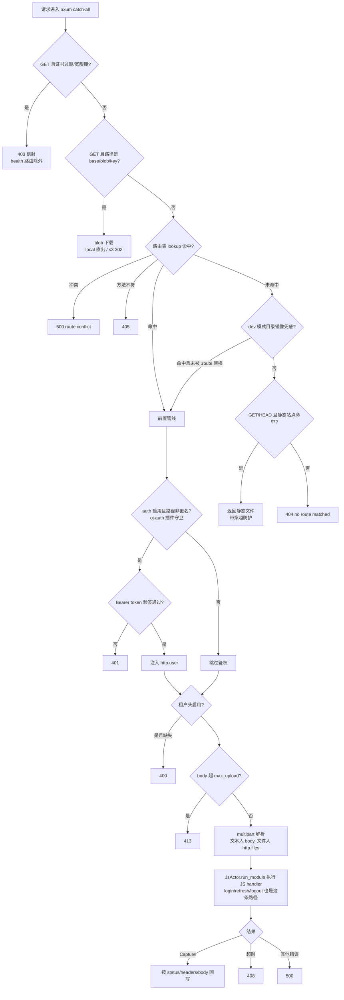
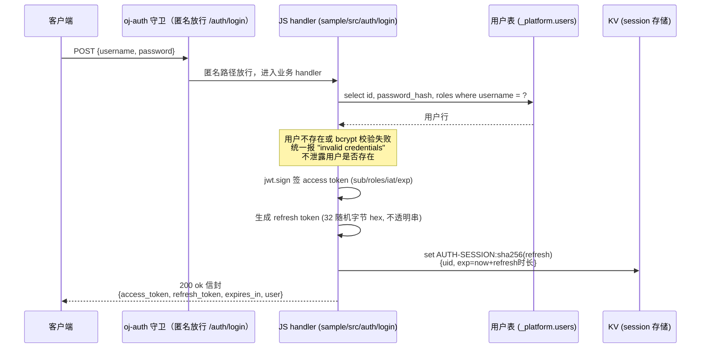
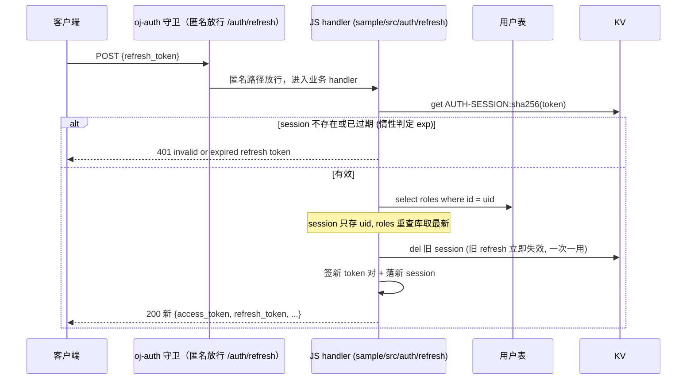
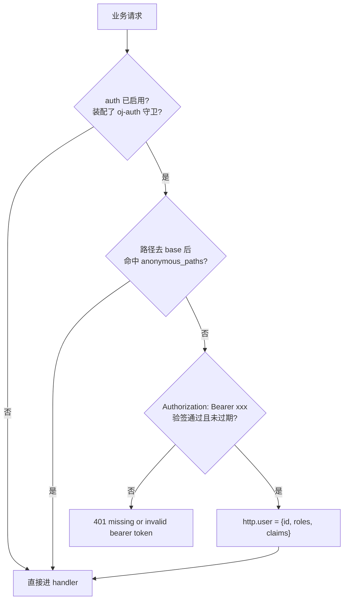

# 内置 API 与鉴权逻辑（新人向）

本文梳理 `only-js` 服务层**内置接口**（不走业务路由表、由 Rust 直接处理的端点）及
auth 鉴权全链路。代码依据：`server/src/lib.rs` 的 `handle()`、`src/bridge/auth.rs`
（`AuthGuard` trait）、`plugins/oj-auth`（守卫插件）、`sample/src/auth/`（JS 端点）、
`src/config.rs`。

## 一、内置接口总览

内置接口 = 不走业务路由表、由 Rust 直接处理的端点（`base` 默认 `/v1/api`）：

| 端点 | 方法 | 鉴权 | 说明 | 代码位置 |
|---|---|---|---|---|
| `{base}/health` | GET | 无 | 健康检查 + 证书状态（证书过期/宽限期仍可访问，供监控） | `lib.rs` `health_handler` |
| `{base}/blob/{key}` | GET | 无（公开） | blob 下载：local 直出字节 / s3 302 presign | `lib.rs` blob 分支 |
| 静态站点 | GET/HEAD | 无 | `server.app_path` 配的目录，优先级最低 | `resolve_static` |

其余所有请求进入**业务路由**：路由表命中 → 前置管线（鉴权/租户/上传）→ JS handler。

`{base}/auth/login|refresh|logout` **不再是内置路由**：它们是普通业务路由，由 JS 模块
`sample/src/auth/` 实现（`db` 查用户表、`bcrypt.verify` 校验、`jwt` 原语签发双 token），
鉴权则由 `oj-auth` 插件守卫在前置管线完成（验签 + `anonymous_paths` 匹配）。auth 端点
自身须在 `auth.anonymous_paths` 里显式匿名（如 `/auth/login`）。

开启方式：`config.yaml` 里 `auth:` 非空才装配 `oj-auth` 守卫（`auth` 配了但 `jwt_secret`
为空 → 启动 fail-fast，不静默跳过）；`blob:` 非空才挂下载路由。

## 二、请求处理总流程（`handle()` 的分支优先级）

## 三、登录时序（`POST /auth/login`，JS 业务实现）

## 四、Refresh 轮换（`POST /auth/refresh`，JS 业务实现）

## 五、业务请求的 Bearer 守卫（oj-auth 插件）

匿名路径匹配规则（oj-auth 插件内）：精确匹配，或尾部 `/*` 做**一层**前缀通配——
`/pub/*` 命中 `/pub/x`，不命中 `/pub` 本身。宿主通过 `AuthGuard` trait（`src/bridge/auth.rs`）
以 FFI 调用插件，返回 `http.user`（JSON）或错误串。

## 六、关键认知

1. **双 token 模型**：access 是 JWT（无服务端状态，logout 后到期前仍有效，已知取舍）；
   refresh 是不透明随机串，服务端 session 存 KV，键 = `AUTH-SESSION:` + sha256(token)，
   可吊销、一次一用（轮换）。
2. **守卫在路由表命中后的前置管线执行；auth 端点是普通业务路由**：`/auth/*` 不再被
   内置拦截，业务代码可用同名路径覆盖/改写它（如 `sample/src/auth/`）；`blob/{key}`
   仍由 Rust 在路由表之前直接处理。
3. **用户表约定**：`users` 表（`_platform` 伪模块持有归属）需有
   `id / username / password_hash(bcrypt) / roles(JSON 数组字符串)` 四列；JS 端点
   查询全部走绑定参数。
4. **鉴权只设防 base 之内**：路径不在 `base` 前缀下（`path_no_base = None`）时不做
   Bearer 检查，交给后续静态/404 分支。
5. **信封统一**：成功走 `{code,msg,data}` ok 信封；所有失败（401/400/405/413/408/500）
   走 fail 信封，HTTP 状态码与信封 code 一致。

## 配置参考（`AuthCfg`，`src/config.rs`）

| 字段 | 默认 | 说明 |
|---|---|---|
| `jwt_secret` | 空（配了 auth 则必填，空 → fail-fast） | HMAC 签名密钥 |
| `signing_method` | `HS256` | HS256 / HS384 / HS512 |
| `access_token_duration` | `60s` | access token 有效期 |
| `refresh_token_duration` | `720h` | refresh token / session 有效期 |
| `anonymous_paths` | `[]` | 免鉴权路径（去 base 后），尾部 `/*` 一层通配 |
