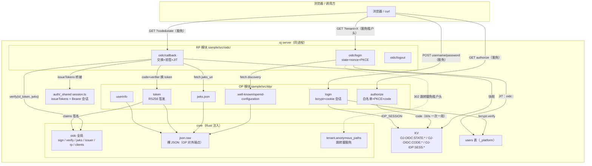
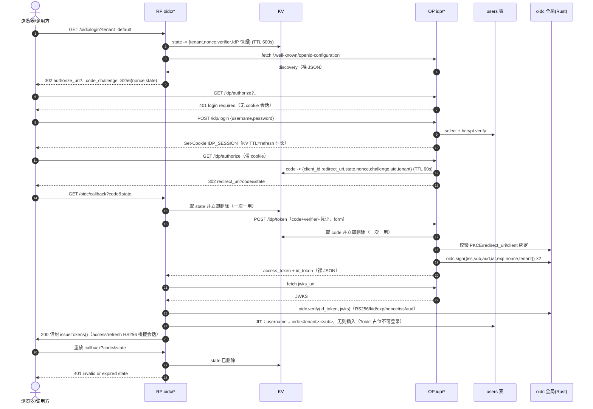
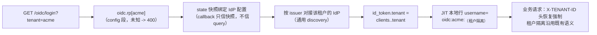

# OIDC 实现文档（OP + RP 双角色）

> 实现走读：sample 内置 OIDC 的架构、时序与数据流。接入视角见
> [oidc-integration.md](oidc-integration.md)，设计裁决见
> `docs/superpowers/specs/2026-09-05-sample-oidc-design.md`。

## 1. 总体架构

同进程双角色：`src/idp/` 是 OP（OIDC Provider，签发身份），`src/oidc/` 是 RP
（Relying Party，消费身份）。两者共享 core 注入的 `oidc` 全局（RS256 原语 + 配置态）
与 KV；会话桥接复用既有 `auth` 模块的 `issueTokens`。业务请求鉴权不变——oj-auth 插件
Bearer 守卫 + 租户头照旧，OIDC 只负责「换 token」那一跳。

要点：

- **密钥不出 Rust**：私钥装配期经 `OidcState::from_section` 装入 `StableState`（构造期、
  不可变），JS 只见 sign/verify/jwks 接口面；手写脱敏 `Debug`，PEM/secret 不进日志。
- **OP 对外端点说标准协议**：discovery/jwks/token/userinfo 成功用 `json.raw` 回裸 JSON
  （RFC 6749 要求 `access_token` 是顶层字段），错误仍走 `{code,msg,data}` 信封。
- **豁免面最小**：`tenant.anonymous_paths` 只豁免「缺失租户头的 400」，且仅列出三条
  跳转腿路径（`/oidc/*`、`/idp/*`、`/idp/.well-known/*`）；带有效租户头的请求照常注入
  `http.tenantId`。匹配是严格一层通配（比 oj-auth 插件的多层前缀更严，深路径需显式列出）。

## 2. 全链时序图

安全闸门与失效路径：

| 闸门 | 失败返回 |
|---|---|
| authorize：client_id/redirect_uri 白名单不命中 | 400（**绝不重定向**） |
| authorize：response_type ≠ code / scope 无 openid / PKCE 非 S256 | 400 |
| authorize / token：会话或 code 无效、过期、已用 | 401 |
| callback：state 无效/过期/重放 | 401 |
| callback：jwks 拉取失败 | 502（**不回落本地验签**） |
| callback：id_token 验签失败 / nonce、iss、aud 与快照不符 | 401 |
| token：code 归属 client 与凭证不符 | 401（RFC 6749 §4.1.3） |

## 3. 多租户数据流

- **RP 侧**：tenant 决定用哪个 IdP。tenant 从 query 进入豁免路由，建 state 时快照进 KV，
  后续只信快照——query 无法劫持已建立的登录流。
- **OP 侧**：tenant 来自 client 注册（`oidc.clients.<id>.tenant`），随 code 进入
  id_token/access_token claims。
- **豁免边界**：只有跳转腿豁免；登录后的业务请求照常强制 `X-TENANT-ID`，与全站语义一致。

## 4. 组件与文件清单

| 组件 | 文件 | 职责 |
|---|---|---|
| 配置段 | `src/config.rs` | `OidcSection{issuer, private_key_path, rp, clients}` + `TenantCfg.anonymous_paths` |
| 状态 | `src/bridge/oidc.rs` | `OidcState`：PKCS#8 装载、kid（sha256(b64u(n)) 前 16 hex）、JWKS、rp/clients 透出；`from_section` fail-fast |
| ops | `src/bridge/oidc.rs` | `op_oidc_sign`（RS256+kid header）/ `op_oidc_verify`（本机或 jwks 按 kid，锁 RS256，leeway 0）/ `op_oidc_info` |
| 裸 JSON | `src/bridge/json.rs` | `json.raw(data)`——200 裸 JSON，默认 content-type，`json.header` 可覆盖 |
| 全局挂载 | `src/bridge/bootstrap.js` | `oidc` 全局（sign/verify/jwks/issuer/rp/clients）；ASCII 纪律 |
| 装配 | `oj/src/app.rs` | `cfg.oidc → OidcState::from_section → Extras.oidc/StableState`（构造期，fail-fast） |
| 租户豁免 | `server/src/lib.rs` | `Pipeline.tenant_anon` + `path_matches`（严格一层通配）；run 闭包豁免缺失头 400 |
| OP | `sample/src/idp/` | discovery / jwks.json / authorize / login / token / userinfo（六端点） |
| RP | `sample/src/oidc/` | login / callback / logout（三端点） |
| 共享工具 | `sample/src/auth/_shared/util.ts` | redirect / nowSecs / b64uFromHex / parseForm / parseCookies（构建顺序 auth 最先） |
| 测试 | `sample/tests/oidc.test.ts` | L1：39 用例（进程内） |
| 测试 | `oj/tests/oidc_e2e.rs` | 真 TCP 全链 e2e。**独立测试目标**：oj-auth 插件 `static GUARD: OnceLock` 进程级只认首次 init，与 e2e.rs 共进程会互染 |

## 5. 已知边界（刻意不做的）

- OP sub = `users.id` 字符串；自举登录 JIT 出 `oidc:default:<id>` 本地行，与原 demo 行
  **不合并**（外部 IdP 语义下 sub 本就 opaque）。
- 不支持：consent 页（登录即同意）、refresh_token / client_credentials grant、
  OP end_session、JWKS 轮换运维（kid 机制已就位，轮换是配置问题）。
- code/state 的消费是 get→del 非原子（重放必落空；并发窗口由 PKCE/state 绑定兜底；
  redis 后端可换 GETDEL）。secret/PKCE 比较非常量时间（demo 范围）。
- `client_secret` 明文存 config（与 `auth.jwt_secret` 同信任级），经 `oidc.rp/clients`
  可读——handler JS 与 jwt_secret 同级受信。
